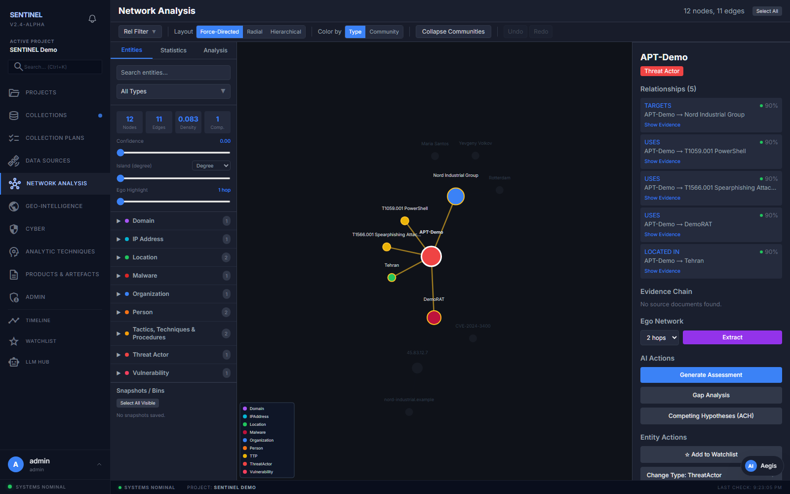
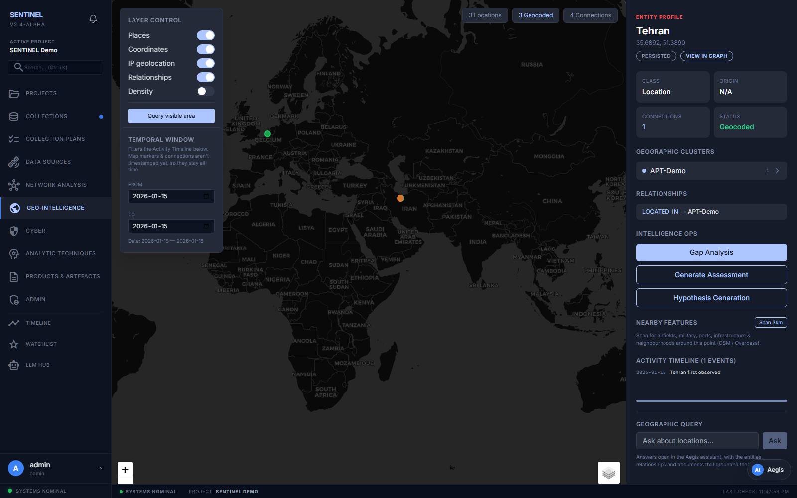
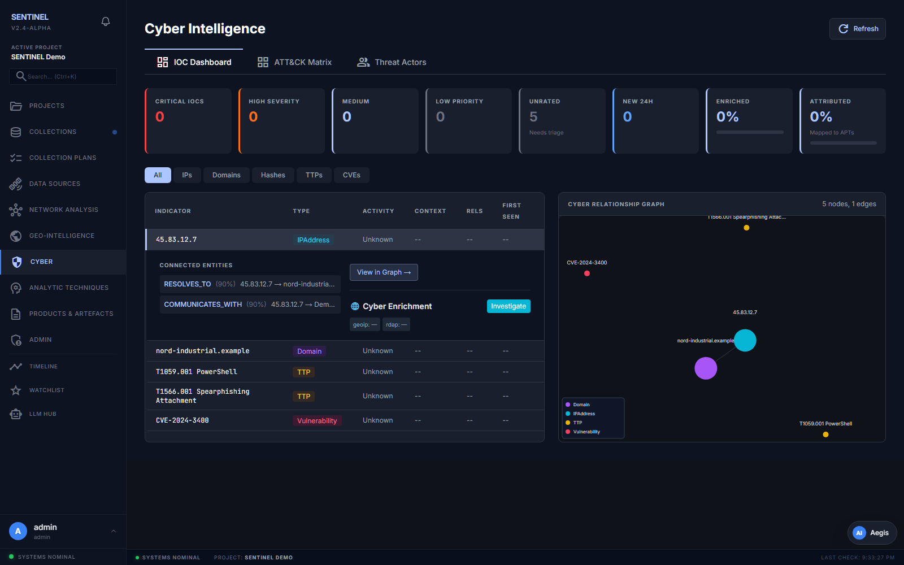
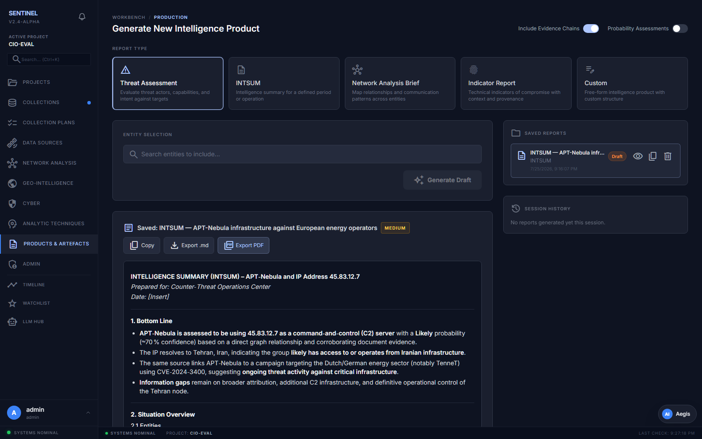
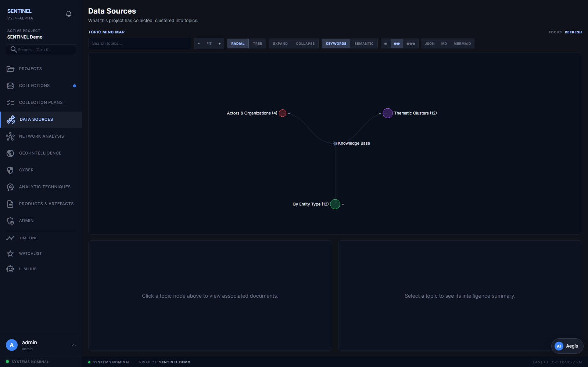
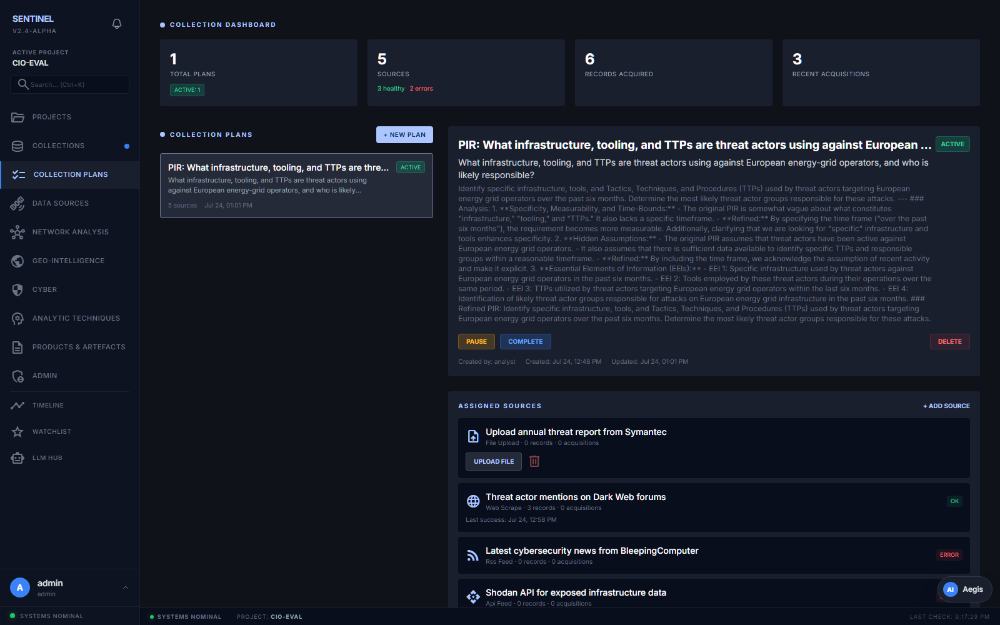

# SENTINEL

**An AI-powered intelligence-analyst workbench.** Point it at the open web and it
collects sources, pulls out the people, places, and things and how they connect,
builds a knowledge graph, and lets an analyst work that graph — visually, on a
map, across a timeline, and through written intelligence products — with every
answer grounded in the documents it collected.


> Runs fully local. The bundled stack ships Ollama + `qwen2.5:14b`, so you can
> collect, extract, and analyze with **no cloud API keys** — or plug in
> Anthropic / OpenAI / Cohere when you want a bigger model.

---

## What it is

SENTINEL is a single-analyst workbench for open-source intelligence work. It
turns a pile of web pages and documents into a structured, queryable picture of a
situation. The core loop is:

**collect** → **extract** → **graph** → **analyze**

You give it an objective; it plans and runs collection against real search
results, extracts entities and typed relationships with a hybrid NLP + LLM
pipeline, writes them into a Neo4j knowledge graph, and hands an analyst a set of
purpose-built views to make sense of it. Retrieval and every generated product
are grounded in the collected evidence, with citations and provenance — not the
model's memory.

## Why it exists

Most "chat with your documents" tools stop at a text box. Intelligence analysis
needs structure: who is connected to whom, where things happened, in what order,
and how confident you are in each claim. SENTINEL is built around that structure —
a graph and a map and a timeline as first-class outputs — and around analytic
tradecraft, encoding source evaluation, hypothesis generation, and gap analysis
as reusable LLM skills rather than ad-hoc prompts. It's a portfolio-scale, honest
implementation of that idea, not a mock-up.

## Features

### Agentic collection
Give it an objective and it plans sources, runs real web search (ddgs), and
crawls candidate pages (crawl4ai), feeding results straight into extraction.
Collection plans are persisted and executed asynchronously via Celery. The
scraper validates URL scheme and host before every fetch (SSRF guardrail), and
collection egress can optionally be routed through a VPN or Tor proxy chosen from
the admin UI — while LLM/cloud calls always stay direct.

### Hybrid NLP + LLM extraction
Extraction runs in `nlp`, `llm`, or `hybrid` mode. Hybrid (the default in the
local stack) combines spaCy NER with an LLM pass to produce typed,
evidence-backed relationships and higher-precision entities, and falls back to
pure NLP if no LLM provider is reachable. Bulk extraction can be pinned to local
Ollama so it never drains a rate-limited cloud key.

### Neo4j knowledge graph + Graph-RAG
Entities and their typed relationships live in Neo4j as a real graph. Analyst
questions are answered with Graph-RAG: structured context is walked from the
graph and blended with vector-similar documents from pgvector, so answers cite
both the connections and the source text.

### Geo / GEOINT
IP/WHOIS and place names are geocoded (Nominatim) into an administrative
hierarchy, plotted on a Leaflet map with a satellite/imagery basemap switcher,
local features from Overpass, MGRS/coordinate literacy, subtype filtering, and
area-of-interest bounding-box queries with geo-confidence and provenance.

### Cyber-observable enrichment
Detects and refangs cyber observables (domains, IPs, hashes, emails) and enriches
them through keyless providers — DNS, GeoIP, CISA KEV, NVD, RDAP/WHOIS, and
certificate transparency. On-demand "Investigate" is always available; auto-enrich
of newly-seen observables at ingest is off by default and toggled in admin.
Enrichment egress uses the same optional collection proxy, never the LLM path.

### Topics, assessments & intelligence products
Documents cluster into topics with an interactive mind-map. Analytic tradecraft
is encoded as versioned LLM **skills** — source evaluation, hypothesis
generation, gap analysis, threat assessment, report writing — and drives
generated intelligence products: Threat Assessments, INTSUMs, Network Analysis
Briefs, and Indicator Reports, each grounded in Graph-RAG retrieval over the
graph.

### Analyst UI
A Next.js workbench with a d3 network graph, the geo map, a timeline with a
temporal slider, topic mind-maps, collections and collection plans, the cyber
enrichment panel, a product generator, and an LLM hub — with undo/redo on graph
state, keyboard shortcuts, and a mobile-aware shell.

## Architecture

```
┌─────────────────────────┐        ┌──────────────────────────────┐
│ frontend/  Next.js 14    │  HTTP  │ backend/  FastAPI (intel_    │
│ App Router · TS · Tail-  │ ─────▶ │ platform)                    │
│ wind · d3 +              │  axios │  • Neo4j        (graph)       │
│ leaflet                  │        │  • Postgres/pgvector (docs,   │
└─────────────────────────┘        │    vectors, collection mgmt)  │
                                    │  • Redis + Celery (async)     │
                                    │  • LLMs: Anthropic/OpenAI/    │
                                    │    Cohere/Ollama (orchestr.)  │
                                    │  • crawl4ai + ddgs collection │
                                    └──────────────────────────────┘
```

Two datastores by design: Neo4j is the knowledge graph (entities, relationships,
and persisted state like watchlists and snapshots); Postgres/pgvector holds
documents, embeddings, and collection-plan state. Every model call routes through
a single provider **orchestrator**. For a deeper tour — package map, dual-datastore
rationale, LLM orchestration, egress proxy, and request flow — see
[`docs/architecture.md`](docs/architecture.md).

## Tech stack

| Layer | Tech |
|-------|------|
| **Backend** | Python 3.11, FastAPI, `uv`-managed. Async SQLAlchemy + httpx; the synchronous Neo4j driver is offloaded to worker threads so it never blocks the event loop. Pydantic v2. |
| **Graph** | Neo4j 5 (community) — entities, relationships, persisted app state. |
| **Documents / vectors** | Postgres 16 + pgvector — documents, embeddings, collection-plan state. |
| **Async** | Redis + Celery for crawls and bulk extraction. |
| **LLMs** | Anthropic, OpenAI, Cohere, Ollama behind one orchestrator; local default `qwen2.5:14b`. |
| **NLP** | spaCy (`en_core_web_sm`), thefuzz, jellyfish, networkx, python-louvain for graph/entity work. |
| **Collection** | crawl4ai (crawler) + ddgs (search). |
| **Geo** | Nominatim + Overpass (keyless), pygeodesy for coordinate/MGRS handling. |
| **Frontend** | Next.js 14 (App Router), TypeScript, Tailwind, d3 (graph/mind-map), raw Leaflet (map), react-markdown. |
| **Deploy** | Single multi-stage Dockerfile (frontend + backend in one image); local full stack via `docker compose`. |

## Screenshots

<!-- Add screenshots to docs/screenshots/ and they'll render below. -->

<!-- SCREENSHOT: /network — the knowledge-graph hero shot (d3 force graph, an entity selected) -->


<!-- SCREENSHOT: /geo — satellite basemap with an area-of-interest box and geolocated entities -->


<!-- SCREENSHOT: /cyber — the EnrichmentPanel showing an investigated observable -->


<!-- SCREENSHOT: /products — a generated INTSUM with citations -->


<!-- SCREENSHOT: topic mind-map (TopicMindMap component) -->


<!-- SCREENSHOT: a collection plan (objective → planned sources → run status) -->


## Quickstart

The recommended path is the full local stack via Docker Compose. It brings up
Neo4j, Postgres/pgvector, Redis, Ollama, the backend, and the frontend together.

```bash
# 1. Copy the config surface and adjust as needed (defaults work for local dev)
cp .env.example .env

# 2. Bring up the full stack
docker compose up
#   neo4j 7474/7687 · postgres 5432 · redis 6379
#   ollama 11434 · backend 8000 · frontend 3000

# 3. First run only — pull the local model into Ollama
docker compose exec ollama ollama pull qwen2.5:14b
```

Then open **http://localhost:3000**. With `EXTRACTION_MODE=hybrid` and the
in-stack Ollama wired up, collection, extraction, and analysis all work with **no
cloud API keys** — add keys in `.env` only if you want a cloud model.

Running the halves individually (for development):

```bash
# Backend  (Python 3.11, uv-managed)
cd backend && uv run uvicorn intel_platform.api.app:app --reload

# Frontend
cd frontend && npm run dev        # http://localhost:3000
```

## Configuration & Security

All configuration lives in [`.env.example`](.env.example) — copy it to `.env`
(gitignored) and edit. Settings load through `intel_platform.config.Settings`
(pydantic-settings); nothing reads the environment ad hoc.

> ### Security — read before you deploy
>
> SENTINEL ships with **development defaults meant for local use only**. It also
> ships the guardrails to lock down — use them. Before exposing an instance to a
> network:
>
> - **Set a strong, non-default `JWT_SECRET`** (never the `.env.example`
>   placeholder) and a strong admin password (`DEFAULT_ADMIN_PASSWORD`).
> - **Set `REQUIRE_SECURE_AUTH=true`.** With this on, the app refuses to start
>   while any built-in default secret, API key, or admin password is still in
>   place — so an insecure instance fails loudly instead of going live quietly.
> - **Change every default datastore credential** (Neo4j, Postgres, Redis) from
>   the compose/dev values.
> - Keep the collection scraper's URL validation and the enrichment/collection
>   egress-proxy options in mind for anything that fetches from the open web.
>
> Never commit `.env` or real keys. The auth model is intentionally lightweight
> (single-analyst; see [Status](#status--limitations)).

## Status & limitations

Honest scope, so there are no surprises:

- **Single-analyst workbench.** Auth is lightweight and single-tenant — there's
  no multi-tenant isolation or team RBAC. Fine for a personal or research
  instance; not a hardened multi-user SaaS.
- **Persistence.** Watchlists, snapshots, users, and projects are persisted to
  Neo4j and survive restarts (collection-plan state lives in Postgres). The one
  remaining in-memory item is the admin LLM provider/model override
  (`_llm_override` in `admin_config`), which resets on restart.
- **Testing.** The backend has a substantial pytest suite (70 test files, 579
  tests across routes, services, collection, enrichment, and geo). The frontend
  has **no test runner yet** — `npm run lint` and `npm run build` are the gate
  there.
- **Migrations.** Postgres schema is created at startup; there's no Alembic
  migration flow yet.

For the full self-commissioned audit and the fixes it drove, see
[`docs/code-review-2026-03-22.md`](docs/code-review-2026-03-22.md).

## Documentation

- [`docs/architecture.md`](docs/architecture.md) — the technical deep-dive.
- [`CLAUDE.md`](CLAUDE.md), [`backend/CLAUDE.md`](backend/CLAUDE.md),
  [`frontend/CLAUDE.md`](frontend/CLAUDE.md) — repo conventions and stack detail.
- [`docs/`](docs/) — specs, plans, and design records.

## License

[MIT](LICENSE) © 2026 OrangeAgente
